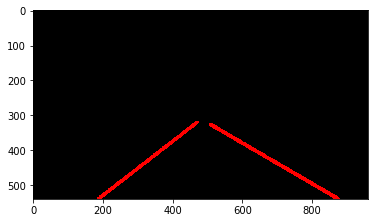

# **Finding Lane Lines on the Road**

---

## Overview

The goals / steps of this project are the following:

* Make a pipeline that finds lane lines on the road
* Reflect on your work in a written report

---

## Reflection

### 1. Describe your pipeline. As part of the description, explain how you modified the draw_lines() function.

pipeline은 총 9개로 구성하였습니다. 

* garyscale 
* canny
* gaussian_blur 
* region_of_interest
* draw_lines
* hough_lines
* weighted_img
* find_lane_lines_formula
* separate_lines

각각의 단계에 대해서 설명 드리겠습니다.

우선 기준이 되는 원본 영상은 아래와 같습니다.

#### 1) garyscale
RGB 영상을 0~255 사이의 grayscale의 영상으로 변환 시키는 작업을 수행합니다.

#### 2) gaussian_blur
영상에서 edge detection을 통해 edge 부분의 정보만 축축하기 전에 영상에 blur 처리했습니다.

#### 3) canny
그 이후 canny 알고리즘 방법을 이용하여서 영상의 edge 부분만 축출하게됩니다.

#### 4) ROI

이 영상중 lane이 존재하는 부분은 어느정도 범위내로 한정되어 있습니다. 따라서 ROI(Region of Interest)영역을 지정하여 보고 싶은 영역에서의 결과만 보도록 하겠습니다.

#### 5) Hough

마지막으로 hough 알고리즘을 이용하여 앞선 영상에서 구해진 edge의 정보를 선으로 이어주는 작업을 수행하였습니다.

이대로 수행과정을 끝낼 수 있으나 한가지 문제가 존재 합니다. 

아래 영상처럼 실선으로 이루어진 선의 경우 중간 중간에 끊어진 lane trace 결과가 나오게 됩니다.

 문제에서 주어졌듯이 이 끊어진 부분을 연결하여 lane을 추적하고자 합니다.

<figure>
 
 <figcaption>
 

 
 
 문제 영상
 
 </figcaption>
</figure>

<figure>
 
 <figcaption>
 

 
 
 해결 영상
 
 </figcaption>
</figure>

따라서 추가적으로 몇가지 작업을 더 수행했습니다.

##### (1) 좌우 lane 분리

좌측과 우측의 lane을 분리하여 경향에 따라 한 줄로 이어버리고자 하였습니다. 

이를 위해서는 우선 좌/우측을 분리할 필요가 있습니다.

`separate_lines` 을 이용하여 아래 그림과 같이 좌우로 lane을 분리하여 인식하였습니다.

그 이후 각각 `find_lane_lines_formula` 을 이용하여 하나의 직선으로 치환하였고 이를 합쳐서 출력했습니다.

### 2. Identify potential shortcomings with your current pipeline

원래 틀을 유지하려다 보니 `Hough_line`함수에 많은 작업이 함께 들어간 것 같아 이를 분리하여 pipline을 구성하면 좀 더 좋은 결과가 나올 것 같습니다.

### 3. Suggest possible improvements to your pipeline

#### 1) color
도로의 lane이 흰색만 있을 경우를 고려하여 작업하였더니 주황색이나 색이 바랜 경우에 대해 좋지 않은 결과를 보이는 것 같습니다.

#### 2) 1D - line
lane의 근사를 직선으로만 근사화 했는데, 커브 등의 도로를 고려한다면 좀 더 non-liner한 근사가 가능하도록 작업해야할 것 같습니다.